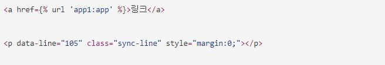

### Blog 빌드 에러 발생
1. 스터디 중 블로그를 확인 했는데 빌드가 터져 기존 글들이 날아가 있는 것을 발견.
2. Github action 빌드 리포트를 확인해보니 다음과 같은 Syntax Error가 발생했지만 정확한 이유를 잡을 수가 없었다.
```
Liquid Exception: Liquid syntax error (line 84): Unknown tag 'url' in /github/workspace/_posts/2022-05-15-django-app-template.md
Liquid Exception: Liquid syntax error (line 83): Unknown tag 'static' in /github/workspace/_posts/2022-05-15-django-app-template.md
```
3. 에러가 발생한 지점은 과  부근으로, 코드블럭 내의 html 구문이 문제인 것으로 추정되어 img파일로 교체해뒀다.